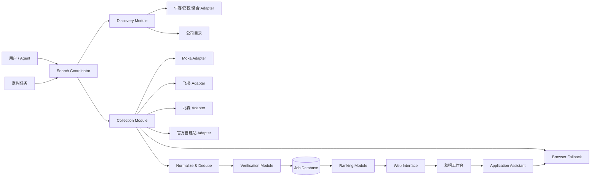

# 秋招雷达：产品与框架设计提案

> 状态：讨论稿 v0.1
> 日期：2026-09-03
> 目的：先确定产品边界、数据流和技术框架，再继续扩展功能。本提案不代表所有选型已经决定。

## 1. 背景与问题

秋招雷达最初是个人使用的岗位工作台：Agent 根据用户偏好临时浏览招聘网站，把结果展示出来，并在用户选定岗位后协助填写网申。

随着目标变成可供其他用户克隆和使用的项目，原方案暴露出几个结构性问题：

- 现场浏览搜索速度慢，覆盖面依赖当次搜索结果，容易偏向大厂。
- 招聘信息分散在官方 ATS、高校就业网、牛客、公众号及聚合项目中。
- 聚合源可能过期，必须回到官方岗位详情确认。
- 岗位数据曾与源码文件绑定，存在被提交到 Git 的风险。
- 浏览器 Agent 擅长处理复杂页面，但不适合承担大规模、重复、确定性的抓取工作。
- 当前只有岗位和进度数据表，缺少公司来源、搜索任务、核验历史和原始证据。
- “个人本地工具”和“可部署的多人网站”需要不同的身份、存储和调度方式。

因此需要把产品从“一段搜索流程”重构为“岗位数据管道 + Agent 工作台”。

## 2. 产品目标与非目标

### 2.1 目标

1. 广覆盖发现 2027 届及后续届别的校园招聘机会，不局限某个岗位或者行业
2. 最终展示的可投岗位必须落到企业官网或企业官方 ATS。
3. 用户打开工作台时能立即看到已有结果，不必等待完整扫描。
4. 支持现场补搜、定时增量更新和投递前复核。
5. 岗位、搜索偏好、简历和投递状态不进入 Git 源码。
6. 浏览器遇到登录、验证码、未知表单时可以安全交还用户。
7. 来源失败、数据过期和核验不足必须可见，不能伪装成确定事实。

### 2.2 非目标

- 不承诺覆盖中国所有企业或所有招聘渠道。
- 不绕过 CAPTCHA、风控、付费墙或访问限制。
- 不默认自动提交申请。
- 不把论坛帖子、内推帖或聚合摘要当作最终岗位事实。
- 第一阶段不建设通用爬虫平台，也不追求一次支持所有 ATS。

## 3. 用户与使用形态

### 3.1 核心使用路径

```text
克隆并启动项目
  → Agent 询问求职偏好
  → 立即查询已有岗位库
  → 后台刷新过期来源并现场补搜缺口
  → 用户筛选、收藏和比较岗位
  → 投递前重新核验官网
  → Browser Use 辅助填写
  → 用户确认上传与最终提交
  → 记录投递进度
```

### 3.2 两种部署形态


| 形态       | 特点                                       | 适合人群                       |
| ---------- | ------------------------------------------ | ------------------------------ |
| 本地单用户 | 数据完全在本机，Agent 与浏览器操作最自然   | 项目维护者、重视隐私的个人用户 |
| 托管多用户 | 网页随时访问，云端定时扫描，数据按用户隔离 | 希望开箱即用的普通用户         |

两者共享领域模型和采集接口，但使用不同的存储与任务 Adapter。首个正式版本建议优先做好本地单用户，再验证托管版本。

## 4. 设计原则

1. **数据库是事实源**：网页只通过接口读取；岗位数据不写入页面或仓库 JSON。
2. **发现与核验分离**：二级来源扩大覆盖，官方 ATS 决定可投状态。
3. **确定性优先**：分页、限流、规范化、去重、缓存由程序完成；LLM 处理语义和未知结构。
4. **增量优先**：保存游标、内容指纹和最近核验时间，避免每次全量重跑。
5. **失败透明**：允许部分成功，按来源记录错误、重试时间和旧数据状态。
6. **投递有闸门**：填写、上传、提交分级确认；登录和验证码交给用户。
7. **深模块**：调用者只接触小而稳定的 Interface，ATS 差异留在 Adapter 内部。

## 5. 推荐总体架构



系统分为四条链路：

- **发现链路**：找到新公司、招聘项目和 ATS 入口。
- **采集链路**：从已知 ATS 批量取得岗位列表和详情。
- **消费链路**：查询、评分、筛选、收藏和状态管理。
- **投递链路**：重新核验后由浏览器协助填写和提交。

## 6. 核心 Module 与 Interface

### 6.1 Discovery Module

职责：从二级渠道发现公司或招聘项目，不输出“已核验岗位”。

```ts
interface DiscoverySource {
  discover(input: DiscoveryQuery, cursor?: string): Promise<DiscoveryPage>;
}

type DiscoveryPage = {
  leads: CompanyLead[];
  nextCursor?: string;
  observedAt: string;
};
```

首批 Adapter：

- GitHub 校招聚合项目
- 牛客企业活动页/校招日程
- 高校就业网
- 手工添加官方招聘入口

实习僧、海投网和微信公众号需要先评估稳定性、访问条款和登录要求，再决定是否实现自动 Adapter。

### 6.2 Career Source Registry

职责：维护“公司 → 招聘系统”的长期资产，避免每次重新猜测入口。

最小 Interface：

```ts
registerSource(companyId, sourceDescriptor)
getActiveSources(companyIds)
markSourceHealth(sourceId, result)
```

来源记录包含 ATS 类型、tenant/slug、入口 URL、最近成功时间、连续失败次数和刷新游标。

### 6.3 Collection Module

职责：隐藏不同 ATS 的查询、分页、详情补全和限流差异，统一输出候选岗位。

```ts
interface JobSourceAdapter {
  collect(source: CareerSource, checkpoint?: Checkpoint): Promise<CollectionResult>;
  fetchDetail(candidate: JobCandidate): Promise<JobDetailResult>;
}
```

优先级建议：

1. 官方公开 JSON/API
2. 页面内 JSON-LD、`__NEXT_DATA__` 或网络响应
3. 稳定 HTML 结构
4. Browser Use 交互解析

首期不要同时实现十种 ATS。建议从实际中国校招覆盖率较高的 Moka、飞书招聘和一个自建站模板开始。

### 6.4 Normalize & Dedupe Module

职责：把来源数据转换为统一 Job 模型并处理重复。

去重顺序：

1. `(source_id, external_job_id)` 强去重。
2. 规范化官方 URL：移除内推码、分享参数和追踪参数。
3. `公司规范域名 + 规范岗位名 + Base + 招聘批次` 软去重。
4. 冲突时保留官方 ATS 为主记录，其他来源作为证据记录，不直接删除。

### 6.5 Verification Module

职责：把候选岗位转换为具有明确可信状态的岗位。

```ts
verify(candidate): Promise<{
  status: 'verified_open' | 'project_only' | 'suspected_closed' | 'login_required' | 'failed';
  evidence: VerificationEvidence;
}>;
```

`verified_open` 至少要求：

- 公司和岗位一致；
- 届别符合搜索目标；
- 官方详情页或接口仍公开；
- 存在申请入口；
- 记录核验时间和内容指纹。

投递前必须重新运行一次 Verification，不直接信任历史状态。

### 6.6 Ranking Module

先做确定性评分，再可选用 LLM 精排：

- 岗位匹配度 30%
- 技术成长空间 20%
- 公司稳定性 15%
- Base 匹配 15%
- 行业前景 10%
- 真实性与时效 10%

评分结果必须区分“页面事实”和“模型判断”。模型判断保存理由、模型版本和评分时间，避免覆盖原始岗位数据。

### 6.7 Application Assistant

状态机：

```text
selected
  → reverified
  → needs_login | ready_to_fill
  → filling
  → needs_user_answer | needs_upload_confirmation | ready_to_review
  → needs_submit_confirmation
  → submitted | failed | cancelled
```

Browser Use 是此 Module 的核心 Adapter，不承担常规定时抓取。CAPTCHA、MFA、SSO、隐私授权和未知事实问题一律暂停。

## 7. 数据模型

### 7.1 建议新增表


| 表                   | 主要用途                                       |
| -------------------- | ---------------------------------------------- |
| `companies`          | 公司规范名称、域名、行业、规模和别名           |
| `career_sources`     | ATS 类型、入口、tenant/slug、健康状态和游标    |
| `discovery_leads`    | 二级来源发现的原始线索及处理状态               |
| `search_profiles`    | 用户届别、岗位族、Base、行业偏好和排除项       |
| `search_runs`        | 一次扫描的状态、统计、开始结束时间             |
| `source_run_results` | 每个来源的成功、失败、数量与错误摘要           |
| `jobs`               | 规范化岗位和当前状态                           |
| `job_source_records` | 来源 external ID、原始 URL、载荷指纹和抓取时间 |
| `job_verifications`  | 每次官网核验的状态与证据                       |
| `job_scores`         | 用户维度的评分及理由                           |
| `applications`       | 投递阶段、材料版本和确认记录                   |

### 7.2 关键字段

`jobs` 不应只保存当前展示字段，还应至少增加：

- `canonical_url`
- `external_job_id`
- `posted_at`
- `first_seen_at`
- `last_seen_at`
- `closed_at`
- `content_hash`
- `verification_status`
- `verification_due_at`

历史关闭岗位不删除，只改变状态，避免重复发现和丢失投递记录。

## 8. 搜索与调度策略

### 8.1 混合模式

推荐采用：后台增量采集 + 用户现场补搜 + 投递前即时核验。


| 场景              | 执行方式                 |
| ----------------- | ------------------------ |
| 已知 ATS 日常更新 | 定时 HTTP/API 抓取       |
| 新公司发现        | 每日扫描二级来源         |
| 用户新建搜索条件  | 先查库，后台刷新过期来源 |
| 未知或动态网站    | Agent 现场 Browser Use   |
| 登录后才可见      | 用户接管登录后继续       |
| 用户准备投递      | 立即重新核验岗位详情     |

### 8.2 推荐频率

- 活跃官方 ATS：每 6–12 小时。
- 牛客、高校就业网、聚合源：每天 1–2 次。
- 用户收藏岗位：每天核验。
- 连续失败来源：指数退避，达到阈值后进入人工检查队列。
- 已关闭岗位：降低到每周抽样复查。

### 8.3 搜索运行状态

网页应展示：`queued / running / partial / completed / failed`，并显示各来源的抓取数量和错误。一处失败不终止整个 run。

## 9. 技术栈方案比较

### 9.1 方案 A：维持纯 TypeScript/Cloudflare

- Web：React + vinext
- 数据：Cloudflare D1
- 调度：Cloudflare Cron Triggers
- 队列：Cloudflare Queues 或按批次拆分 Cron
- 采集：Worker `fetch` + TypeScript Adapter
- 浏览器：用户本机 Browser Use

优点：仓库统一、部署简单、当前代码迁移少。
缺点：本地单用户体验和云端状态需要兼容；复杂浏览器采集不能直接运行在普通 Worker 中。

### 9.2 方案 B：TypeScript Web + Python 采集 Sidecar

- Web/API：当前 TypeScript 项目
- 数据：本地 SQLite 或云端 D1/Postgres
- 采集：Python worker，利用 JobSpy、Playwright 和现有招聘库
- 通信：本地 HTTP/任务表

优点：招聘爬取生态更丰富，浏览器和数据处理工具成熟。
缺点：安装、打包、跨平台和部署复杂度明显提高。

### 9.3 方案 C：Agent 即采集器

- 所有发现、抓取和核验都由 Codex/Claude Code + Browser Use 完成。

优点：开发速度快，适应未知网页。
缺点：慢、贵、不可预测、难做覆盖率和定时任务，不适合作为长期主架构。

### 9.4 推荐

首期选择 **方案 A 为主、方案 C 兜底**：

- TypeScript 实现公司目录、任务、ATS Adapter、去重和 D1。
- Agent 负责偏好询问、扩展新来源、处理未知网页和协助投递。
- 当 Moka/飞书等接口实测难以稳定通过 Worker 获取时，再为相关 Adapter 引入小型 Python sidecar，而不是一开始双栈。

## 10. 本地与托管的数据隔离

### 10.1 Git 规则

- 仓库不包含真实岗位列表、搜索历史、简历或投递记录。
- 只提交数据库 schema、迁移、Adapter 代码和无个人信息的测试 fixture。
- 本地数据库、浏览器 profile、日志、截图和生成材料全部忽略。

### 10.2 身份

- 本地模式使用固定 local user，但数据库文件只存在本机。
- 托管模式使用 ChatGPT/Sites 身份，所有用户数据表都必须带 `user_id`。
- 公司和公开岗位可以作为共享基础数据；用户评分、收藏和申请状态必须隔离。

### 10.3 隐私

- 简历默认不上传到公共服务。
- LLM 精排前明确展示会发送哪些字段。
- 日志不得记录 Cookie、Token、验证码或完整个人资料。

## 11. 当前项目差距

当前已经具备：

- React 工作台；
- D1 `jobs`、`application_progress` 和 `search_requests`；
- `/api/jobs` 与 `/api/progress`；
- Browser Use 初始化与 `campus-job-radar` Skill；
- 基础岗位展示、筛选、评分和进度选择。

仍缺少：

- 公司目录和招聘来源注册表；
- 真正的 ATS Adapter；
- 搜索 run 与来源级状态；
- 自动调度和增量 checkpoint；
- 原始来源记录与核验证据；
- 稳健的跨来源去重；
- 岗位关闭检测；
- 工作台主动发起搜索和查看扫描进度；
- 本地模式存储方案的正式定义；
- 投递状态机与材料版本。

## 12. 分阶段实施建议

### Phase 0：确定产品边界

共同决定本文第 13 节的关键问题。完成标准：部署形态、首批来源和投递自动化边界明确。

### Phase 1：数据库驱动闭环

- 清除源码中的真实岗位数据。
- 扩充 `companies / career_sources / search_runs / job_source_records / verifications`。
- 页面展示空状态、扫描状态、来源和核验时间。
- 提供手工导入官方岗位和创建搜索任务的接口。

完成标准：岗位只经数据库流转，Git 中没有运行数据。

### Phase 2：三个来源 Adapter

- 一个结构化发现源：GitHub 校招聚合项目。
- 一个社区/高校发现源：牛客活动页或高校就业网。
- 一个官方采集源：在 Moka 与飞书中选择实测更稳定的一种。
- 实现分页、限流、checkpoint、失败隔离和去重测试。

完成标准：无需浏览器即可稳定产生一批官网可追溯候选。

### Phase 3：混合搜索体验

- 用户运行秋招雷达时先查库。
- 后台刷新过期来源，前端展示增量结果。
- 未知网站生成 Browser Use 待办。
- Agent 把浏览器核验结果通过接口写回。

完成标准：用户数秒内看到旧结果，并能观察新结果逐步进入。

### Phase 4：投递辅助

- 投递前重新核验。
- 支持字段映射、材料选择、填表截图和人工确认。
- 登录、验证码及未知问题接管。
- 保存申请证据和失败原因。

完成标准：完成一个官方 ATS 的“填到提交前”闭环，不默认自动提交。

### Phase 5：调度与托管

- 增加定时扫描、告警和来源健康面板。
- 评估共享公共岗位库与多用户隔离。
- 根据成本决定 D1、Queues 和浏览器执行节点。

## 13. 需要共同敲定的决策

### D1：产品首先服务谁？

- A. 个人本地工具
- B. 可被任何人克隆的本地工具
- C. 托管多用户产品

**建议：B 优先，架构为 C 保留身份和数据隔离能力。**

### D2：公共岗位库是否共享？

- A. 每个用户各自抓取并保存
- B. 公司与岗位公共共享，偏好和投递状态私有

**建议：B。** 招聘岗位是公开事实，重复抓取浪费资源；但用户评分、收藏和申请必须隔离。

### D3：首批支持哪些来源？

候选：GitHub 聚合源、牛客活动页、高校就业网、Moka、飞书招聘、北森。

**建议：先选 2 个发现源 + 1 个官方 ATS，用真实成功率决定下一批。**

### D4：是否需要 Python Sidecar？

- A. 第一阶段全 TypeScript
- B. 立即引入 Python/JobSpy/Playwright worker

**建议：先 A。** 只有当实际来源证明 TypeScript Adapter 不够用时，再局部引入 Python。

### D5：自动投递到什么程度？

- A. 只打开岗位官网
- B. 自动填写并停在提交前
- C. 用户一次授权后自动提交

**建议：B。** 它兼顾效率、真实性和账号安全。

### D6：更新方式？

- A. 只在用户运行时搜索
- B. 只依赖定时扫描
- C. 定时扫描 + 现场补搜 + 投递前核验

**建议：C。**

### D7：是否允许需要登录的二级平台自动采集？

**建议：首期不做后台登录采集。** 用户现场登录时可由 Browser Use 读取，公开 ATS 和公开就业网承担后台覆盖。

## 14. 建议的第一次评审顺序

1. 先确认 D1、D2：决定产品和数据归属。
2. 再确认 D3、D4：决定第一阶段工程范围。
3. 再确认 D5、D7：确定浏览器自动化安全边界。
4. 最后确认 Phase 1–2 是否可以开始实现。

在这些决策确定前，不建议继续大量增加搜索提示词、公司名单或页面功能，因为它们都依赖底层产品形态和数据模型。

## 15. 参考研究

GitHub 开源求职 Agent 的源码对比与具体链接见：

- [GitHub 开源求职 Agent：岗位搜索实现研究](../research/github-job-agents.md)
